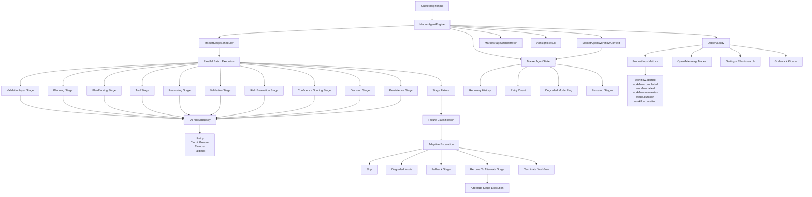

# Market Agent Engine

A deterministic, multi-stage AI workflow orchestration engine for financial market insight generation.

The system treats LLMs as **interchangeable execution components** inside a structured, policy-governed workflow graph.

---

## Key Features

* Multi-stage agent pipeline (Planning → Reasoning → Decision)
* Dependency-based stage scheduler
* Parallel batch execution (fan-out / fan-in)
* Policy-driven resilience (retry, timeout, circuit breaker)
* Full observability (OpenTelemetry + metrics)
* Fully deterministic testable architecture (no external LLM dependency required)

---

## Architecture Overview

The engine executes a **directed workflow graph** where each stage is:

* Independently executable
* Dependency-aware
* Policy-governed
* Observable
* Retry-safe

### Core Components

* `MarketAgentEngine` → Orchestrates workflow execution
* `IMarketStageScheduler` → Controls execution order + state
* `IMarketAgentStage` → Modular pipeline stage
* `IAiPolicyRegistry` → Resilience policies per stage
* `IMarketStageOrchestrator` → Execution decision engine

---

## Execution Model

Stages are executed as a directed acyclic workflow graph (DAG-like execution model with controlled fan-out and fan-in semantics).

The engine supports:

* **Fan-out execution** → independent stages run in parallel
* **Fan-in coordination** → dependent stages wait for upstream completion
* **State tracking** → each stage is marked as:

  * Pending
  * Completed
  * Skipped
  * Failed

---

## LLM Abstraction Layer

LLM interactions are fully abstracted behind interfaces.

They are currently **mocked for deterministic testing, pipeline validation, and offline development**, allowing the workflow engine to be tested independently of external model dependencies.

### Runtime switching

```csharp id="gq9k21"
if (useMock)
{
    services.AddSingleton<IAiInsightProvider<QuoteInsightInput>, MockQuoteInsightProvider>();
}
else
{
    services.AddSingleton<IAiInsightProvider<QuoteInsightInput>, SemanticKernelQuoteInsightProvider>();

    // Agent-based orchestration pipeline
    services.AddSingleton<IAiInsightProvider<QuoteInsightInput>, AgentQuoteInsightProvider>();
}
```

### Agent Provider

```csharp id="p1q7kd"
public sealed class AgentQuoteInsightProvider(MarketAgentEngine agent)
    : IAiInsightProvider<QuoteInsightInput>
{
    public Task<AIInsightResult> GenerateAsync(
        QuoteInsightInput input,
        CancellationToken ct = default)
        => agent.RunAsync(input, ct);
}
```

---

## Resilience & Policies

Each stage is wrapped with:

* Retry policies (exponential backoff)
* Circuit breakers
* Timeouts per operation
* External dependency isolation

All policies are centralized in `IAiPolicyRegistry`.

---

## Testing Strategy

The system is designed for **fully deterministic execution**:

* No external LLM dependency in tests
* Mocked insight providers
* Reproducible workflow execution
* Stage-level unit testing
* Full orchestration integration tests

---

## Observability

* OpenTelemetry tracing per workflow + stage
* Execution metrics (duration, failures, throughput)
* Correlation ID propagation
* Structured logging per stage lifecycle

---

## Current Status

The engine is **substantially built and architecture-complete**, including:

* Multi-stage orchestration engine
* Dependency-aware scheduler
* Parallel execution model
* Policy-based resilience layer
* Observability instrumentation
* Full test coverage with mocked and real pipelines

The system continues to evolve in:

* Throughput optimization
* Advanced orchestration patterns
* Enhanced agent coordination strategies
* Tooling + LLM integration improvements

---

## Summary

The Market Agent Engine is a **workflow-first AI orchestration system** where:

> LLMs are treated as pluggable execution units inside a deterministic, testable, policy-driven pipeline.

---

# Architecture Diagram




